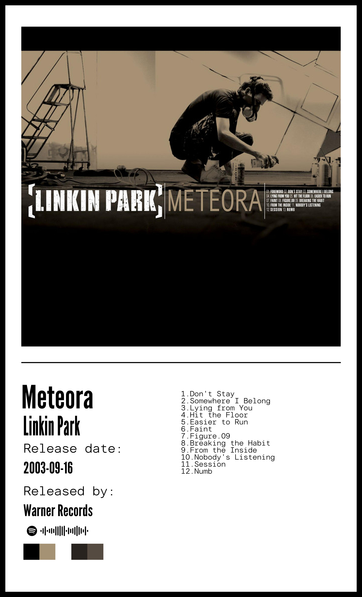

# TwojPosterGenerator Description

This project automatically creates visually appealing posters with information about your favorite music albums using data fetched from Spotify. Below is a detailed description of how the program works.

## Features

1. **Authorization and Connection to Spotify API**:
    - The program starts by reading the authentication credentials from the `auth_manager.txt` file and uses them to connect to the Spotify API.
    
2. **Fetching Artist Information**:
    - Based on the provided artist name, the program searches for the artist's ID on Spotify and retrieves detailed information about the artist.

3. **Fetching Album Information**:
    - Using the provided album name and artist name, the program searches for the album on Spotify and retrieves data such as the album title, release date, record label name, and album cover image.

4. **Creating the Poster**:
    - The program creates a new image where it places the fetched album cover, text with the album name, artist name, release date, record label name, and a scannable Spotify code.
    - Additionally, the poster includes the album's tracklist and the five most common colors from the album cover.

5. **Saving the Result**:
    - The finished poster is saved as `final_result.jpg`, which can be used for decorative or promotional purposes.
    


## Usage

To use this program:

1. Configure your Spotify API credentials and place them in the `auth_manager.txt` file in the format `client_id;client_secret`.
2. Provide the artist and album names in the appropriate places in the code.
3. Run the program to generate the poster.

An example usage for the album "Meteora" by "Linkin Park" looks like this:
```python
# name
artist_name = "linkin park"
# album
album_name = "meteora"
```

## Example Poster

The poster includes:
- Album cover
- Album name
- Artist name
- Release date
- Record label name
- Scannable Spotify code
- Tracklist
- Five most common colors from the album cover

The poster is saved as `final_result.jpg` and is visually appealing, making it perfect for a music fan's room decoration or as promotional material.

## Requirements

- Python
- Libraries: `PIL`, `spotipy`, `requests`
- Spotify Developers account for obtaining authentication credentials

## Installation

To install the required libraries, use the following command:
```bash
pip install pillow spotipy requests
```

Enjoy automatically creating posters of your favorite albums!